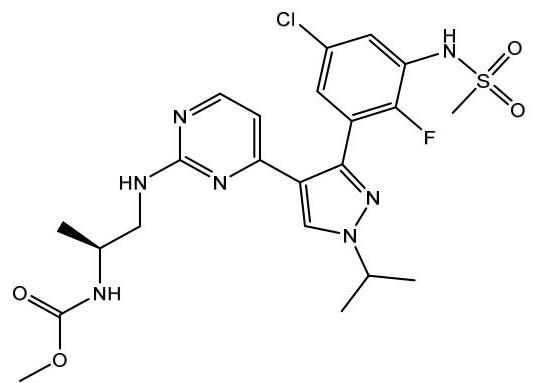
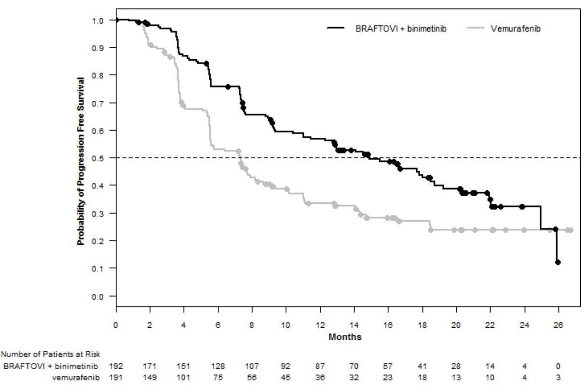

Pfizer

Mektovi

Binimetinib

15 mg film-coated tablets

Reference Market: US

AfME markets using this LPD: Egypt

Egypt, March 2025

1

# HIGHLIGHTS OF PRESCRIBING INFORMATION

These highlights do not include all the information needed to use MEKTOVI safely and effectively. See full prescribing information for MEKTOVI.

## MEKTOVI® (binimetinib) tablets, for oral use

Initial U.S. Approval: 2018

---

### INDICATIONS AND USAGE

MEKTOVI is a kinase inhibitor indicated:

- in combination with encorafenib, for the treatment of patients with unresectable or metastatic melanoma with a BRAF V600E or V600K mutation, as detected by an FDA-approved test. (1.1, 2.1)
- in combination with encorafenib, for the treatment of adult patients with metastatic non-small cell lung cancer (NSCLC) with a BRAF V600E mutation, as detected by an FDA-approved test. (1.2, 2.1)

---

### DOSAGE AND ADMINISTRATION

#### Melanoma

- Confirm the presence of BRAF V600E or V600K mutation in tumor specimens prior to the initiation of MEKTOVI. (2.1)
- The recommended dose is 45 mg orally twice daily in combination with encorafenib. Take MEKTOVI with or without food. (2.2)
- For patients with moderate or severe hepatic impairment the recommended dose is 30 mg orally twice daily. (2.4, 8.6)

#### NSCLC

- Confirm the presence of BRAF V600E mutation in tumor or plasma specimens prior to initiating MEKTOVI. (2.1)
- The recommended dose is 45 mg orally twice daily in combination with encorafenib. Take MEKTOVI with or without food. (2.2)

---

### DOSAGE FORMS AND STRENGTHS

Tablets: 15 mg. (3)

---

### CONTRAINDICATIONS

None. (4)

---

### WARNINGS AND PRECAUTIONS

- New Primary Malignancies, Cutaneous and Non-cutaneous: Can occur when MEKTOVI is used in combination with encorafenib. Monitor patients for new malignancies prior to initiation of treatment, during treatment, and after discontinuation of treatment. (5.1)
- Cardiomyopathy: Assess left ventricular ejection fraction (LVEF) before initiating treatment, after one month of treatment, then every 2 to 3 months thereafter. The safety of MEKTOVI has not been established in patients with LVEF below 50%. (5.2)
- Venous Thromboembolism: Deep vein thrombosis and pulmonary embolism can occur. (5.3)
- Ocular Toxicities: Serous retinopathy, retinal vein occlusion (RVO) and uveitis have occurred. Perform an ophthalmologic evaluation at regular intervals and for any visual disturbances. (5.4)
- Interstitial Lung Disease (ILD): Assess new or progressive unexplained pulmonary symptoms or findings for possible ILD. (5.5)
- Hepatotoxicity: Monitor liver function tests before and during treatment with MEKTOVI and encorafenib and as clinically indicated. (5.6)
- Rhabdomyolysis: Monitor creatine phosphokinase and creatinine periodically and as clinically indicated. (5.7)
- Hemorrhage: Major hemorrhagic events can occur in patients receiving MEKTOVI and encorafenib. (5.8)
- Embryo-Fetal Toxicity: Can cause fetal harm. Advise females with reproductive potential of potential risk to the fetus and to use effective contraception. (5.9, 8.1, 8.3)

---

### ADVERSE REACTIONS

Melanoma: Most common adverse reactions (≥25%) for MEKTOVI, in combination with encorafenib, are fatigue, nausea, diarrhea, vomiting, and abdominal pain. (6.1)

NSCLC: Most common adverse reactions (≥25%) for MEKTOVI, in combination with encorafenib, are fatigue, nausea, diarrhea, musculoskeletal pain, vomiting, abdominal pain, visual impairment, constipation, dyspnea, rash, and cough. (6.1)

---

### USE IN SPECIFIC POPULATIONS

Lactation: Advise not to breastfeed. (8.2)

See 17 for PATIENT COUNSELING INFORMATION and Medication Guide.

Revised: March 2025

---

## FULL PRESCRIBING INFORMATION: CONTENTS*

### 1 INDICATIONS AND USAGE

1.1 BRAF V600E or V600K Mutation-Positive Unresectable or Metastatic Melanoma
1.2 BRAF V600E Mutation-Positive Metastatic Non-Small Cell Lung Cancer (NSCLC)

### 2 DOSAGE AND ADMINISTRATION

2.1 Patient Selection
2.2 Recommended Dosage and Administration
2.3 Dosage Modifications for Adverse Reactions
2.4 Dosage Modifications for Moderate or Severe Hepatic Impairment

### 3 DOSAGE FORMS AND STRENGTHS

### 4 CONTRAINDICATIONS

### 5 WARNINGS AND PRECAUTIONS

5.1 New Primary Malignancies
5.2 Cardiomyopathy
5.3 Venous Thromboembolism
5.4 Ocular Toxicities
5.5 Interstitial Lung Disease
5.6 Hepatotoxicity
5.7 Rhabdomyolysis
5.8 Hemorrhage
5.9 Embryo-Fetal Toxicity
5.10 Risks Associated with Combination Treatment

### 6 ADVERSE REACTIONS

6.1 Clinical Trials Experience

### 7 DRUG INTERACTIONS

### 8 USE IN SPECIFIC POPULATIONS

8.1 Pregnancy
8.2 Lactation
8.3 Females and Males of Reproductive Potential
8.4 Pediatric Use
8.5 Geriatric Use
8.6 Hepatic Impairment

### 10 OVERDOSAGE

### 11 DESCRIPTION

### 12 CLINICAL PHARMACOLOGY

12.1 Mechanism of Action
12.2 Pharmacodynamics
12.3 Pharmacokinetics

### 13 NONCLINICAL TOXICOLOGY

13.1 Carcinogenesis, Mutagenesis, Impairment of Fertility

### 14 CLINICAL STUDIES

14.1 BRAF V600E or V600K Mutation-Positive Unresectable or Metastatic Melanoma
14.2 BRAF V600E Mutation-Positive Metastatic Non-Small Cell Lung Cancer

### 16 HOW SUPPLIED/STORAGE AND HANDLING

### 17 PATIENT COUNSELING INFORMATION

*Sections or subsections omitted from the full prescribing information are not listed.

2

# FULL PRESCRIBING INFORMATION

## 1 INDICATIONS AND USAGE

### 1.1 BRAF V600E or V600K Mutation-Positive Unresectable or Metastatic Melanoma

MEKTOVI is indicated, in combination with encorafenib, for the treatment of patients with unresectable or metastatic melanoma with a BRAF V600E or V600K mutation, as detected by an FDA-approved test [see Dosage and Administration (2.1)].

### 1.2 BRAF V600E Mutation-Positive Metastatic Non-Small Cell Lung Cancer (NSCLC)

MEKTOVI is indicated, in combination with encorafenib, for the treatment of adult patients with metastatic non-small cell lung cancer (NSCLC) with a BRAF V600E mutation, as detected by an FDA-approved test. [see Dosage and Administration (2.1)].

## 2 DOSAGE AND ADMINISTRATION

### 2.1 Patient Selection

**BRAF V600E or V600K Mutation-Positive Unresectable or Metastatic Melanoma**

Confirm the presence of a BRAF V600E or V600K mutation in tumor specimens prior to initiating MEKTOVI [see Clinical Studies (14)]. Information on FDA-approved tests for the detection of BRAF V600E and V600K mutations in melanoma is available at: http://www.fda.gov/CompanionDiagnostics.

**BRAF V600E Mutation-Positive Metastatic Non-Small Cell Lung Cancer (NSCLC)**

Confirm the presence of a BRAF V600E mutation in tumor or plasma specimens prior to initiating MEKTOVI [see Clinical Studies (14.2)]. If no mutation is detected in a plasma specimen, test tumor tissue. Information on FDA-approved tests for the detection of BRAF V600E mutations in NSCLC is available at: http://www.fda.gov/CompanionDiagnostics.

### 2.2 Recommended Dosage and Administration

The recommended dosage of MEKTOVI is 45 mg orally taken twice daily, approximately 12 hours apart, in combination with encorafenib until disease progression or unacceptable toxicity. Refer to the encorafenib prescribing information for recommended encorafenib dosing information.

MEKTOVI may be taken with or without food [see Clinical Pharmacology (12.3)]. Do not take a missed dose of MEKTOVI within 6 hours of the next dose of MEKTOVI.

Do not take an additional dose if vomiting occurs after MEKTOVI administration but continue with the next scheduled dose.

### 2.3 Dosage Modifications for Adverse Reactions

If encorafenib is permanently discontinued, discontinue MEKTOVI.

Dose reductions for adverse reactions associated with MEKTOVI are presented in Table 1.

Table 1: Recommended Dose Reductions for MEKTOVI for Adverse Reactions

|  Action | Recommended Dose  |
| --- | --- |
|  First Dose Reduction | 30 mg orally twice daily  |
|  Subsequent Modification | Permanently discontinue if unable to tolerate MEKTOVI 30 mg orally twice daily  |

Dosage modifications for adverse reactions associated with MEKTOVI are presented in Table 2.

Table 2: Recommended Dosage Modifications for MEKTOVI for Adverse Reactions

|  Severity of Adverse Reaction^{a} | Dose Modification for MEKTOVI  |
| --- | --- |
|  Cardiomyopathy [see Warnings and Precautions (5.2)]  |   |

Table 2: Recommended Dosage Modifications for MEKTOVI for Adverse Reactions

|  Severity of Adverse Reactiona | Dose Modification for MEKTOVI  |
| --- | --- |
|  ·Asymptomatic, absolute decrease in LVEF of greater than 10% from baseline that is also below lower limit of normal (LLN) | Withhold MEKTOVI for up to 4 weeks, evaluate LVEF every 2 weeks. Resume MEKTOVI at a reduced dose if the following are present: ·LVEF is at or above the lower limit of normal and ·Absolute decrease from baseline is 10% or less and ·Patient is asymptomatic. If the LVEF does not recover within 4 weeks permanently discontinue MEKTOVI.  |
|  ·Symptomatic congestive heart failure or absolute decrease in LVEF of greater than 20% from baseline that is also below LLN | Permanently discontinue MEKTOVI.  |
|  Venous Thromboembolism [see Warnings and Precautions (5.3)]  |   |
|  ·Uncomplicated deep venous thrombosis (DVT) or pulmonary embolism (PE) | Withhold MEKTOVI. ·If improves to Grade 0-1, resume at a reduced dose. ·If no improvement, permanently discontinue MEKTOVI.  |
|  ·Life threatening PE | Permanently discontinue MEKTOVI.  |
|  Serous Retinopathy [see Warnings and Precautions (5.4)]  |   |
|  ·Symptomatic serous retinopathy/Retinal pigment epithelial detachments | Withhold MEKTOVI for up to 10 days. ·If improves and becomes asymptomatic, resume at same dose. ·If not improved, resume at a lower dose level or permanently discontinue MEKTOVI.  |
|  Retinal Vein Occlusion (RVO) [see Warnings and Precautions (5.4)]  |   |
|  ·Any Grade | Permanently discontinue MEKTOVI.  |
|  Uveitis [see Warnings and Precautions (5.4)]  |   |
|  ·Grade 1-3 | If Grade 1 or 2 does not respond to specific ocular therapy, or for Grade 3 uveitis, withhold MEKTOVI for up to 6 weeks. ·If improved, resume at same or reduced dose. ·If not improved, permanently discontinue MEKTOVI.  |
|  ·Grade 4 | Permanently discontinue MEKTOVI.  |
|  Interstitial Lung Disease [see Warnings and Precautions (5.5)]  |   |
|  ·Grade 2 | Withhold MEKTOVI for up to 4 weeks. ·If improved to Grade 0-1, resume at a reduced dose. ·If not resolved within 4 weeks, permanently discontinue MEKTOVI.  |
|  ·Grade 3 or Grade 4 | Permanently discontinue MEKTOVI.  |
|  Hepatotoxicity [see Warnings and Precautions (5.6)]  |   |
|  ·Grade 2 AST or ALT increased | Maintain MEKTOVI dose. ·If no improvement within 2 weeks, withhold MEKTOVI until improved to Grade 0-1 or to pretreatment/baseline levels and then resume at the same dose.  |
|  ·Grade 3 or 4 AST or ALT increased | See Other Adverse Reactions.  |
|  Rhabdomyolysis or Creatine Phosphokinase (CPK) elevations [see Warnings and Precautions (5.7)]  |   |
|  ·Grade 4 asymptomatic CPK elevation or ·Any Grade CPK elevation with symptoms or with renal impairment | Withhold MEKTOVI dose for up to 4 weeks. ·If improved to Grade 0-1 resume at a reduced dose. ·If not resolved within 4 weeks, permanently discontinue MEKTOVI.  |

Table 2: Recommended Dosage Modifications for MEKTOVI for Adverse Reactions

|  Severity of Adverse Reaction^a | Dose Modification for MEKTOVI  |
| --- | --- |
|  Dermatologic [other than palmar plantar erythrodysesthesia syndrome (PPES)] [see Adverse Reactions (6.1)]  |   |
|  • Grade 2 | If no improvement within 2 weeks, withhold MEKTOVI until Grade 0-1. Resume at same dose if first occurrence or reduce dose if recurrent.  |
|  • Grade 3 | Withhold MEKTOVI until Grade 0-1. Resume at same dose if first occurrence or reduce dose if recurrent.  |
|  • Grade 4 | Permanently discontinue MEKTOVI.  |
|  Other Adverse Reactions (including Hemorrhage) [see Warnings and Precautions (5.8), Adverse Reactions (6.1)]^b  |   |
|  • Recurrent Grade 2 or
• First occurrence of any Grade 3 | Withhold MEKTOVI for up to 4 weeks.
• If improves to Grade 0-1 or to pretreatment/baseline levels, resume at reduced dose.
• If no improvement, permanently discontinue MEKTOVI.  |
|  • First occurrence of any Grade 4 | Permanently discontinue MEKTOVI, or
Withhold MEKTOVI for up to 4 weeks.
• If improves to Grade 0-1 or to pretreatment/baseline levels, then resume at a reduced dose.
• If no improvement, permanently discontinue MEKTOVI.  |
|  • Recurrent Grade 3 | Consider permanently discontinuing MEKTOVI.  |
|  • Recurrent Grade 4 | Permanently discontinue MEKTOVI.  |

a. National Cancer Institute Common Terminology Criteria for Adverse Events (NCI CTCAE) version 4.03.
b. Dose modification of MEKTOVI when administered with encorafenib is not recommended for the following adverse reactions: palmar-plantar erythrodysesthesia syndrome (PPES), non-cutaneous RAS mutation-positive malignancies, and QTc prolongation.

Refer to the encorafenib prescribing information for dose modifications for adverse reactions associated with encorafenib.

## 2.4 Dosage Modifications for Moderate or Severe Hepatic Impairment

For patients with moderate (total bilirubin greater than 1.5 and less than or equal to $3 \times$ ULN and any AST) or severe (total bilirubin levels greater than $3 \times$ ULN and any AST) hepatic impairment, the recommended dosage is $30\mathrm{mg}$ orally taken twice daily [see Use in Specific Populations (8.6), Clinical Pharmacology (12.3)].

## 3 DOSAGE FORMS AND STRENGTHS

Tablets: $15\mathrm{mg}$, yellow to dark yellow, unscored ovaloid biconvex film-coated tablets debossed with stylized “A” debossed on one side and “15” on the other side.

## 4 CONTRAINDICATIONS

None.

## 5 WARNINGS AND PRECAUTIONS

### 5.1 New Primary Malignancies

New primary malignancies, cutaneous and non-cutaneous, can occur when MEKTOVI is used in combination with encorafenib.

In PHAROS, cutaneous squamous cell carcinoma and skin papilloma each occurred in $2\%$ of patients who received MEKTOVI in combination with encorafenib.

Monitor patients for new malignancies prior to initiation of treatment, while on treatment, and after discontinuation of treatment [see Dosage and Administration (2.3)].

### 5.2 Cardiomyopathy

Cardiomyopathy, manifesting as left ventricular dysfunction associated with symptomatic or asymptomatic decreases in ejection fraction, has been reported in patients treated with MEKTOVI in combination with

encorafenib. In COLUMBUS, evidence of cardiomyopathy (decrease in LVEF below the institutional LLN with an absolute decrease in LVEF ≥10% below baseline as detected by echocardiography or MUGA) occurred in 7% of patients receiving MEKTOVI plus encorafenib. Grade 3 left ventricular dysfunction occurred in 1.6% of patients. The median time to first occurrence of left ventricular dysfunction (any grade) in patients receiving MEKTOVI in combination with encorafenib was 3.6 months (range 0 to 21 months). Cardiomyopathy resolved in 87% of patients receiving MEKTOVI plus encorafenib.

In PHAROS, evidence of cardiomyopathy (decrease in LVEF below the institutional LLN with an absolute decrease in LVEF ≥10% below baseline as detected by echocardiography or MUGA) occurred in 11% of patients receiving MEKTOVI in combination with encorafenib. Grade 3 left ventricular dysfunction occurred in 1% of patients. Cardiomyopathy resolved in 82% of patients receiving MEKTOVI plus encorafenib.

Assess ejection fraction by echocardiogram or MUGA scan prior to initiating treatment, one month after initiating treatment, and then every 2 to 3 months during treatment. The safety of MEKTOVI in combination with encorafenib has not been established in patients with a baseline ejection fraction that is either below 50% or below the institutional lower limit of normal (LLN). Patients with cardiovascular risk factors should be monitored closely when treated with MEKTOVI.

Withhold, reduce dose, or permanently discontinue based on severity of adverse reaction [see Dosage and Administration (2.3), Adverse Reactions (6.1)].

## 5.3 Venous Thromboembolism

In COLUMBUS, venous thromboembolism (VTE) occurred in 6% of patients receiving MEKTOVI in combination with encorafenib, including 3.1% of patients who developed pulmonary embolism. In PHAROS, VTE occurred in 7% of patients receiving MEKTOVI in combination with encorafenib, including 1% of patients who developed pulmonary embolism.

Withhold, reduce dose, or permanently discontinue based on severity of adverse reaction [see Dosage and Administration (2.3), Adverse Reactions (6.1)].

## 5.4 Ocular Toxicities

### Serous Retinopathy

In COLUMBUS, serous retinopathy occurred in 20% of patients treated with MEKTOVI in combination with encorafenib; 8% were retinal detachment and 6% were macular edema. Symptomatic serous retinopathy occurred in 8% of patients with no cases of blindness. No patient discontinued MEKTOVI due to serous retinopathy; 6% of patients required dose interruptions or dose reductions. The median time to onset of the first event of serous retinopathy (all grades) was 1.2 months (range 0 to 17.5 months).

In PHAROS, serous retinopathy (retinal detachment) occurred in 2% of patients with no cases of blindness treated with MEKTOVI in combination with encorafenib. No patient permanently discontinued MEKTOVI due to serous retinopathy; 1% of patients required dose interruptions.

Assess for visual symptoms at each visit. Perform an ophthalmologic examination at regular intervals, for new or worsening visual disturbances, and to follow new or persistent ophthalmologic findings. Withhold, reduce dose, or permanently discontinue based on severity of adverse reaction [see Dosage and Administration (2.3), Adverse Reactions (6.1)].

### Retinal Vein Occlusion

RVO is a known class-related adverse reaction of MEK inhibitors and may occur in patients treated with MEKTOVI in combination with encorafenib. In patients with BRAF mutation-positive melanoma receiving MEKTOVI with encorafenib (n=690), 1 patient experienced RVO (0.1%).

The safety of MEKTOVI has not been established in patients with a history of RVO or current risk factors for RVO including uncontrolled glaucoma or a history of hyperviscosity or hypercoagulability syndromes.

Perform ophthalmologic evaluation for patient-reported acute vision loss or other visual disturbance within 24 hours. Permanently discontinue MEKTOVI in patients with documented RVO [see Dosage and Administration (2.3), Adverse Reactions (6.1)].

Uveitis

Uveitis, including iritis and iridocyclitis, has been reported in patients treated with MEKTOVI in combination with encorafenib. In COLUMBUS, the incidence of uveitis among patients treated with MEKTOVI in combination with encorafenib was 4%. In PHAROS, uveitis occurred in 1% of patients receiving MEKTOVI in combination with encorafenib.

Assess for visual symptoms at each visit. Perform an ophthalmologic evaluation at regular intervals and for new or worsening visual disturbances, and to follow new or persistent ophthalmologic findings. Withhold, reduce dose, or permanently discontinue based on severity of adverse reaction [see Dosage and Administration (2.3), Adverse Reactions (6.1)].

5.5 Interstitial Lung Disease

In patients with BRAF mutation-positive melanoma receiving MEKTOVI with encorafenib (n=690), 2 patients (0.3%) developed interstitial lung disease (ILD), including pneumonitis. In PHAROS, 1 patient (1%) receiving MEKTOVI with encorafenib developed pneumonitis.

Assess new or progressive unexplained pulmonary symptoms or findings for possible ILD. Withhold, reduce dose, or permanently discontinue based on severity of adverse reaction [see Dosage and Administration (2.3), Adverse Reactions (6.1)].

5.6 Hepatotoxicity

Hepatotoxicity can occur when MEKTOVI is administered in combination with encorafenib. In COLUMBUS, the incidence of Grade 3 or 4 increases in liver function laboratory tests in patients receiving MEKTOVI in combination with encorafenib was 6% for alanine aminotransferase (ALT), 2.6% for aspartate aminotransferase (AST), and 0.5% for alkaline phosphatase. No patient experienced Grade 3 or 4 serum bilirubin elevation. In PHAROS, the incidence of Grade 3 or 4 increases in liver function laboratory tests in patients receiving MEKTOVI in combination with encorafenib was 10% for AST, 9% for ALT, and 3.2% for alkaline phosphatase.

Monitor liver laboratory tests before initiation of MEKTOVI, monthly during treatment, and as clinically indicated. Withhold, reduce dose, or permanently discontinue based on severity of adverse reaction [see Dosage and Administration (2.3), Adverse Reactions (6.1)].

5.7 Rhabdomyolysis

Rhabdomyolysis can occur when MEKTOVI is administered in combination with encorafenib. In COLUMBUS, elevation of laboratory values of serum CPK occurred in 58% of patients treated with MEKTOVI in combination with encorafenib. In patients with BRAF mutation-positive melanoma receiving MEKTOVI with encorafenib (n=690), rhabdomyolysis was reported in 1 patient (0.1%). In PHAROS, elevation of laboratory values of serum creatine kinase (CK) occurred in 41% of patients treated with MEKTOVI in combination with encorafenib. No patient experienced rhabdomyolysis.

Monitor CPK and creatinine levels prior to initiating MEKTOVI, periodically during treatment, and as clinically indicated. Withhold, reduce dose, or permanently discontinue based on severity of adverse reaction [see Dosage and Administration (2.3), Adverse Reactions (6.1)].

5.8 Hemorrhage

Hemorrhage can occur when MEKTOVI is administered in combination with encorafenib. In COLUMBUS, hemorrhage occurred in 19% of patients receiving MEKTOVI in combination with encorafenib. Grade 3 or greater hemorrhage occurred in 3.2% of patients. The most frequent hemorrhagic events were gastrointestinal, including rectal hemorrhage (4.2%), hematochezia (3.1%), and hemorrhoidal hemorrhage (1%). Fatal intracranial hemorrhage in the setting of new or progressive brain metastases occurred in 1.6% of patients.

In PHAROS, hemorrhage occurred in 12% of patients receiving MEKTOVI in combination with encorafenib including fatal hemorrhage intracranial (1%); Grade 3 or 4 hemorrhage occurred in 4.1% of patients. The most frequent hemorrhagic events were anal hemorrhage and hemothorax (2% each).

6

Withhold, reduce dose, or permanently discontinue based on severity of adverse reaction [see Dosage and Administration (2.3), Adverse Reactions (6.1)].

## 5.9 Embryo-Fetal Toxicity

Based on findings from animal studies and its mechanism of action, MEKTOVI can cause fetal harm when administered to a pregnant woman. Binimetinib was embryotoxic and abortifacient when administered to rabbits during the period of organogenesis at doses greater than or equal to those resulting in exposures approximately 5 times the human exposure at the recommended clinical dose of 45 mg twice daily.

Advise pregnant women and females of reproductive potential of the potential risk to a fetus. Advise females of reproductive potential to use effective contraception during treatment with MEKTOVI and for 30 days after the last dose [see Use in Specific Populations (8.1, 8.3)].

## 5.10 Risks Associated with Combination Treatment

MEKTOVI is indicated for use in combination with encorafenib. Refer to the encorafenib prescribing information for additional risk information that applies to combination use treatment.

## 6 ADVERSE REACTIONS

The following adverse reactions are described elsewhere in the labeling:

- New Primary Malignancies [see Warnings and Precautions (5.1)]
- Cardiomyopathy [see Warnings and Precautions (5.2)]
- Venous Thromboembolism [see Warnings and Precautions (5.3)]
- Ocular Toxicities [see Warnings and Precautions (5.4)]
- Interstitial Lung Disease [see Warnings and Precautions (5.5)]
- Hepatotoxicity [see Warnings and Precautions (5.6)]
- Rhabdomyolysis [see Warnings and Precautions (5.7)]
- Hemorrhage [see Warnings and Precautions (5.8)]
- Embryo-Fetal Toxicity [see Warnings and Precautions (5.9)]
- Risks Associated with Combination Treatment [see Warnings and Precautions (5.10)]

## 6.1 Clinical Trials Experience

Because clinical trials are conducted under widely varying conditions, adverse reaction rates observed in the clinical trials of a drug cannot be directly compared to rates in the clinical trials of another drug and may not reflect the rates observed in practice.

The data described in WARNINGS AND PRECAUTIONS reflect exposure of 192 patients with BRAF V600 mutation-positive unresectable or metastatic melanoma to MEKTOVI 45 mg twice daily in combination with encorafenib 450 mg once daily in a randomized open-label, active-controlled trial (COLUMBUS) [see Clinical Studies (14.1)] or, for rare events, exposure of 690 patients with BRAF V600 mutation-positive melanoma to MEKTOVI 45 mg twice daily in combination with encorafenib once daily across multiple clinical trials (NCT03915951, NCT01909453).

The pooled safety population described in the WARNINGS AND PRECAUTIONS also reflect exposure of 98 patients with BRAF V600E mutation-positive metastatic non-small cell lung cancer to MEKTOVI 45 mg twice daily and encorafenib 450 mg once daily until disease progression or unacceptable toxicity in PHAROS [see Clinical Studies (14.2)].

### BRAF V600E or V600K Mutation-Positive Unresectable or Metastatic Melanoma

The data described below reflect exposure of 192 patients with BRAF V600 mutation-positive unresectable or metastatic melanoma to MEKTOVI (45 mg twice daily) in combination with encorafenib (450 mg once daily) in COLUMBUS.

The COLUMBUS trial [see Clinical Studies (14.1)] excluded patients with a history of Gilbert's syndrome, abnormal left ventricular ejection fraction, prolonged QTc (&gt;480 msec), uncontrolled hypertension, and history or current evidence of retinal vein occlusion. The median duration of exposure was 11.8 months for

7

patients treated with MEKTOVI in combination with encorafenib and 6.2 months for patients treated with vemurafenib.

The most common (≥25%) adverse reactions in patients receiving MEKTOVI in combination with encorafenib were fatigue, nausea, diarrhea, vomiting, and abdominal pain.

Adverse reactions leading to dose interruptions of MEKTOVI occurred in 33% of patients receiving MEKTOVI in combination with encorafenib; the most common were left ventricular dysfunction (6%) and serous retinopathy (5%). Adverse reactions leading to dose reductions of MEKTOVI occurred in 19% of patients receiving MEKTOVI in combination with encorafenib; the most common were left ventricular dysfunction (3%), serous retinopathy (3%), and colitis (2%). Five percent (5%) of patients receiving MEKTOVI in combination with encorafenib experienced an adverse reaction that resulted in permanent discontinuation of MEKTOVI. The most common adverse reactions resulting in permanent discontinuation of MEKTOVI were hemorrhage in 2% and headache in 1% of patients.

Table 3 and Table 4 present adverse drug reactions and laboratory abnormalities, respectively, identified in COLUMBUS. The COLUMBUS trial was not designed to demonstrate a statistically significant difference in adverse reaction rates for MEKTOVI in combination with encorafenib, as compared to vemurafenib, for any specific adverse reaction listed in Table 3.

8

Table 3: Adverse Reactions Occurring in ≥10% of Patients Receiving MEKTOVI in Combination with Encorafenib in COLUMBUSᵃ

|  Adverse Reaction | MEKTOVI with encorafenib N=192 |   | Vemurafenib N=186  |   |
| --- | --- | --- | --- | --- |
|   |  All Grades (%) | Grades 3 and 4ᵇ (%) | All Grades (%) | Grades 3 and 4ᵇ (%)  |
|  General Disorders and Administration Site Conditions  |   |   |   |   |
|  Fatigueᶜ | 43 | 3 | 46 | 6  |
|  Pyrexiaᶜ | 18 | 4 | 30 | 0  |
|  Peripheral edemaᶜ | 13 | 1 | 15 | 1  |
|  Gastrointestinal Disorders  |   |   |   |   |
|  Nausea | 41 | 2 | 34 | 2  |
|  Diarrhea | 36 | 3 | 34 | 2  |
|  Vomitingᶜ | 30 | 2 | 16 | 1  |
|  Abdominal painᶜ | 28 | 4 | 16 | 1  |
|  Constipation | 22 | 0 | 6 | 1  |
|  Skin and Subcutaneous Tissue Disorders  |   |   |   |   |
|  Rashᶜ | 22 | 1 | 53 | 13  |
|  Nervous System Disorders  |   |   |   |   |
|  Dizzinessᶜ | 15 | 3 | 4 | 0  |
|  Visual Disorders  |   |   |   |   |
|  Visual impairmentᶜ | 20 | 0 | 4 | 0  |
|  Serous retinopathy/RPEDᶜ | 20 | 3 | 2 | 0  |
|  Vascular Disorders  |   |   |   |   |
|  Hemorrhageᶜ | 19 | 3 | 9 | 2  |
|  Hypertensionᶜ | 11 | 6 | 11 | 3  |

a. Grades per National Cancer Institute CTCAE v4.03.
b. Grade 4 adverse reactions limited to diarrhea (n=1) and hemorrhage (n=3) in the MEKTOVI with encorafenib arm and constipation (n=1) in the vemurafenib arm.
c. Represents a composite of multiple, related preferred terms.

Other clinically important adverse reactions occurring in &lt;10% of patients who received MEKTOVI in combination with encorafenib were:

Gastrointestinal disorders: Colitis

Skin and subcutaneous tissue disorders: Panniculitis, Photosensitivity

Immune system disorders: Drug hypersensitivity

Table 4: Laboratory Abnormalities Occurring in  $\geq 10\%$  (All grades) of Patients Receiving MEKTOVI in Combination with Encorafenib in COLUMBUSa

|  Laboratory Abnormality | MEKTOVI with encorafenib N=192 |   | Vemurafenib N=186  |   |
| --- | --- | --- | --- | --- |
|   |  All Grades (%) | Grades 3 and 4 (%) | All Grades (%) | Grades 3 and 4 (%)  |
|  Hematology  |   |   |   |   |
|  Anemia | 36 | 3.6 | 34 | 2.2  |
|  Leukopenia | 13 | 0 | 10 | 0.5  |
|  Lymphopenia | 13 | 2.1 | 30 | 7  |
|  Neutropenia | 13 | 3.1 | 4.8 | 0.5  |
|  Chemistry  |   |   |   |   |
|  Increased Creatinine | 93 | 3.6 | 92 | 1.1  |
|  Increased Creatine Phosphokinase | 58 | 5 | 3.8 | 0  |
|  Increased Gamma Glutamyl Transferase | 45 | 11 | 34 | 4.8  |
|  Increased ALT | 29 | 6 | 27 | 2.2  |
|  Increased AST | 27 | 2.6 | 24 | 1.6  |
|  Increased Alkaline Phosphatase | 21 | 0.5 | 35 | 2.2  |
|  Hyponatremia | 18 | 3.6 | 15 | 0.5  |

a. Grades per National Cancer Institute CTCAE v4.03.

# BRAF V600E Mutation-Positive Metastatic Non-Small Cell Lung Cancer (NSCLC)

The safety of MEKTOVI in combination with encorafenib is described in 98 patients with  $BRAF$  V600E mutation-positive metastatic NSCLC who received MEKTOVI (45 mg twice daily) in combination with encorafenib (450 mg once daily) in an open-label, single-arm trial (PHAROS).

The PHAROS trial [see Clinical Studies (14.2)] excluded patients with abnormal LVEF, prolonged QTc  $(&gt;480~\mathrm{ms})$ , uncontrolled hypertension, and history or current evidence of retinal vein occlusion. The median duration of treatment for MEKTOVI and encorafenib was 8.4 and 9.2 months respectively.

The most common  $(\geq 25\%)$  adverse reactions in patients receiving MEKTOVI were fatigue, nausea, diarrhea, musculoskeletal pain, vomiting, abdominal pain, visual impairment, constipation, dyspnea, rash, and cough.

Adverse reactions leading to dose interruptions of MEKTOVI occurred in  $62\%$  of patients receiving MEKTOVI; the most common  $(\geq 5\%)$  were diarrhea  $(17\%)$ ; nausea  $(15\%)$ ; fatigue  $(9\%)$ ; AST increased  $(7\%)$ ; ALT increased, anemia, musculoskeletal pain, vomiting  $(6\%$  each); and acute kidney injury, hemorrhage, and LV dysfunction/cardiomyopathy  $(5\%$  each). Adverse reactions leading to dose reductions of MEKTOVI occurred in  $33\%$  of patients receiving MEKTOVI; the most common  $(\geq 5\%)$  were diarrhea  $(8\%)$ , nausea  $(6\%)$ , and AST increased  $(5\%)$ . A total of  $17\%$  of patients receiving MEKTOVI experienced an adverse reaction that resulted in permanent discontinuation of MEKTOVI; the most common  $(\geq 2\%)$  were diarrhea  $(3.1\%)$ ; musculoskeletal pain, LV dysfunction/cardiomyopathy, fatigue, nausea, rash, visual impairment, and vomiting  $(2\%$  each). None of the other adverse reactions leading to permanent discontinuation of MEKTOVI occurred in more than 1 patient.

Serious adverse reactions occurred in  $38\%$  of patients who received MEKTOVI in combination with encorafenib. Serious adverse reactions in  $\geq 2\%$  of patients included hemorrhage  $(6\%)$ ; diarrhea  $(4.1\%)$ ; anemia, dyspnea, pneumonia  $(3.1\%$  each); arrhythmia, device related infection, edema, myocardial infarction, and pleural effusion  $(2\%$  each). Fatal adverse reactions occurred in  $2\%$  of patients who received MEKTOVI  $(45\mathrm{mg}$  twice-daily) in combination with encorafenib, including intracranial hemorrhage and myocardial infarction  $(1\%$  each).

Table 5 and Table 6 present adverse drug reactions and laboratory abnormalities, respectively, identified in PHAROS.
Table 5: Adverse Reactions Occurring in  $\geq  {10}\%$  of Patients Receiving MEKTOVI in Combination with Encorafenib in PHAROS  ${}^{a}$

|  Adverse Reaction | MEKTOVI with encorafenib N=98  |   |
| --- | --- | --- |
|   |  All Grades (%) | Grade 3 and 4b (%)  |
|  General Disorders and Administration Site Conditions  |   |   |
|  Fatiguec | 61 | 8  |
|  Edemad | 23 | 1  |
|  Pyrexia | 22 | 0  |
|  Gastrointestinal Disorders  |   |   |
|  Nausea | 58 | 3.1  |
|  Diarrheae | 52 | 7  |
|  Vomiting | 37 | 1  |
|  Abdominal painf | 32 | 1  |
|  Constipation | 27 | 0  |
|  Eye Disorders  |   |   |
|  Visual impairmentg | 29 | 2  |
|  Musculoskeletal and Connective Tissue Disorders  |   |   |
|  Musculoskeletal painh | 48 | 4.1  |
|  Skin and Subcutaneous Tissue Disorders  |   |   |
|  Rashj | 27 | 3.1  |
|  Pruritisj | 16 | 0  |
|  Dry skin | 13 | 0  |
|  Alopecia | 12 | 0  |
|  Respiratory, Thoracic and Mediastinal Disorders  |   |   |
|  Dyspnea k | 27 | 8  |
|  Coughl | 26 | 0  |
|  Nervous System Disorders  |   |   |
|  Dizzinessm | 17 | 1  |
|  Headache | 11 | 0  |
|  Metabolism and Nutrition Disorders  |   |   |
|  Decreased appetite | 14 | 1  |
|  Vascular Disorders  |   |   |
|  Hemorrhageh,n | 12 | 4.1  |
|  Hypertension | 10 | 5  |
|  Cardiac Disorders  |   |   |
|  Left ventricular dysfunction/cardiomyopathyo | 11 | 1  |
|  Investigations  |   |   |
|  Weight increased | 11 | 1  |
|  Psychiatric Disorders  |   |   |
|  Insomnia | 10 | 0  |

a. Grades per National Cancer Institute CTCAE v4.03.
b. One Grade 5 adverse reaction of hemorrhage occurred.

c. Fatigue includes fatigue, asthenia.
d. Edema includes edema peripheral, generalized edema, swelling, localized edema, face edema.
e. Diarrhea includes diarrhea, colitis.
f. Abdominal pain includes abdominal pain, abdominal pain upper, abdominal discomfort, epigastric discomfort.
g. Visual impairment includes vision blurred, visual impairment, vitreous floaters, photophobia, visual acuity reduced, photopsia.
h. Musculoskeletal pain includes back pain, arthralgia, pain in extremity, myalgia, musculoskeletal chest pain, non-cardiac chest pain, neck pain.
i. Rash includes rash, rash macular, rash maculo-papular, rash papular, rash pustular, dermatitis acneiform, palmar-plantar erythrodysesthesia syndrome, eczema, skin exfoliation.
j. Pruritis includes pruritus, pruritus genital.
k. Dyspnea includes dyspnea, dyspnea exertional.
l. Cough includes cough, productive cough.
m. Dizziness includes dizziness, balance disorder.
n. Hemorrhage includes anal hemorrhage, hemothorax, gastrointestinal hemorrhage, hematochezia, hematuria, hemoptysis, hemorrhage intracranial, hyphema, small intestinal hemorrhage, upper gastrointestinal hemorrhage, vaginal hemorrhage.
o. Left ventricular dysfunction/cardiomyopathy includes ejection fraction decreased, cardiac failure, cardiac failure congestive.

Other clinically important adverse reactions occurring in  $&lt; 10\%$  of patients who received MEKTOVI in combination with encorafenib were:

Nervous system disorders: Peripheral neuropathy, Dysgeusia, Facial paresis

Gastrointestinal disorders: Pancreatitis

Skin and subcutaneous tissue disorders: Hyperkeratosis, Erythema, Photosensitivity

Immune system disorders: Drug hypersensitivity

Table 6: Laboratory Abnormalities Occurring in  $\geq 10\%$  (All Grades) of Patients Receiving MEKTOVI with Encorafenib in PHAROSa

|  Laboratory Abnormalityb | MEKTOVI with encorafenib  |   |
| --- | --- | --- |
|   |  All Grades (%) | Grades 3 and 4 (%)  |
|  Hematology  |   |   |
|  Anemia | 47 | 11  |
|  Lymphopenia | 24 | 6  |
|  Thrombocytopenia | 20 | 1.1  |
|  Leukopenia | 12 | 0  |
|  Neutropenia | 12 | 1.1  |
|  Chemistry  |   |   |
|  Increased creatinine | 91 | 3.2  |
|  Hyperglycemia | 48 | 6  |
|  Increased creatine kinase | 41 | 3.3  |
|  Lipase increased | 40 | 14  |
|  Increased ALT | 34 | 9  |
|  Hypoalbuminemia | 32 | 0  |
|  Increased AST | 31 | 10  |
|  Increased alkaline phosphatase | 31 | 3.2  |
|  Hyperkalemia | 31 | 2.1  |
|  Hyponatremia | 26 | 11  |
|  Serum amylase increased | 22 | 1.1  |
|  Hypocalcemia | 12 | 2.1  |

a. Grades per National Cancer Institute CTCAE v4.03.
b. Based on the number of patients with available baseline and at least one on-treatment laboratory test.

To report any side effect(s):

|  **Egypt:**  |
| --- |
|  Pharmacovigilance center, Pfizer Pharmaceutical Company: EGY.AEReporting@pfizer.com  |
|  Egyptian Pharmacovigilance center (EPVC), EDA: pv.followup@edaegypt.gov.eg  |

## 7 DRUG INTERACTIONS

No clinically important drug interactions have been observed with MEKTOVI.

## 8 USE IN SPECIFIC POPULATIONS

### 8.1 Pregnancy

#### Risk Summary

Based on findings from animal reproduction studies and its mechanism of action [see Clinical Pharmacology (12.1)], MEKTOVI can cause fetal harm when administered to a pregnant woman. There are no available clinical data on the use of MEKTOVI during pregnancy. In animal reproduction studies, oral administration of binimetinib during the period of organogenesis was embryotoxic and an abortifacient in rabbits at doses greater than or equal to those resulting in exposures approximately 5 times the human exposure at the clinical dose of 45 mg twice daily (see Data). Advise pregnant women and females of reproductive potential of the potential risk to a fetus.

In the U.S. general population, the estimated background risk of major birth defects and miscarriage in clinically recognized pregnancies is 2% to 4% and 15% to 20%, respectively.

#### Data

##### Animal Data

In reproductive toxicity studies, administration of binimetinib to rats during the period of organogenesis resulted in maternal toxicity, decreased fetal weights and increased variations in ossification at doses ≥30 mg/kg/day (approximately 37 times the human exposure based on AUC at the recommended clinical dose of 45 mg twice daily). In pregnant rabbits, administration of binimetinib during the period of organogenesis resulted in maternal toxicity, decreased fetal body weights, an increase in malformations, and increased post-implantation loss, including total loss of pregnancy at doses ≥10 mg/kg/day (approximately 5 times the human exposure based on AUC at the recommended clinical dose of 45 mg twice daily). There was a significant increase in fetal ventricular septal defects and pulmonary trunk alterations at 20 mg/kg/day of binimetinib (less than 8 times the human exposure at the recommended clinical dose of 45 mg twice daily).

### 8.2 Lactation

#### Risk Summary

There are no data on the presence of binimetinib or its active metabolite in human milk, or the effects of binimetinib on the breastfed child, or the effects on milk production. Because of the potential for serious adverse reactions in a breastfed child, advise women not to breastfeed during treatment with MEKTOVI and for 3 days after the last dose.

### 8.3 Females and Males of Reproductive Potential

Based on animal data, MEKTOVI can cause fetal harm when administered to a pregnant woman [see Use in Specific Populations (8.1)].

#### Pregnancy Testing

Verify the pregnancy status of females of reproductive potential prior to initiating MEKTOVI [see Use in Specific Populations (8.1)].

#### Contraception

##### Females

Advise females of reproductive potential to use effective contraception during treatment with MEKTOVI and for 30 days after the last dose.

## 8.4 Pediatric Use

The safety and effectiveness of MEKTOVI have not been established in pediatric patients.

## 8.5 Geriatric Use

Of the 690 patients with BRAF mutation-positive melanoma who received MEKTOVI in combination with encorafenib across multiple clinical trials, 20% were aged 65 to 74 years and 8% were aged 75 years and older [see Clinical Pharmacology (12.3)].

Of the 98 patients with BRAF V600E mutation-positive metastatic NSCLC who received MEKTOVI in combination with encorafenib, 62 (63.2%) were 65 years of age and over and 20 (20.4%) were 75 years and over [see Clinical Studies (14.2)].

No overall differences in the safety or effectiveness of MEKTOVI plus encorafenib were observed in older patients as compared to younger patients.

## 8.6 Hepatic Impairment

Binimetinib concentrations may increase in patients with moderate or severe hepatic impairment. Dose adjustment for MEKTOVI is not recommended in patients with mild hepatic impairment (total bilirubin &gt;1 and ≤1.5 × ULN and any AST or total bilirubin ≤ ULN and AST &gt; ULN). Reduce the dose of MEKTOVI for patients with moderate (total bilirubin &gt;1.5 and ≤3 × ULN and any AST) or severe (total bilirubin levels &gt;3 × ULN and any AST) hepatic impairment [see Dosage and Administration (2.4), Clinical Pharmacology (12.3)].

## 10 OVERDOSAGE

Since binimetinib is 97% bound to plasma proteins, hemodialysis is likely to be ineffective in the treatment of overdose with MEKTOVI.

## 11 DESCRIPTION

Binimetinib is a kinase inhibitor. The chemical name is 5-[(4-bromo-2-fluorophenyl)amino]-4-fluoro-N-(2-hydroxyethoxy)-1-methyl-1H-benzimidazole-6-carboxamide. The molecular formula is C₁₇H₁₅BrF₂N₄O₃ and the molecular weight is 441.2 daltons. The chemical structure of binimetinib is shown below:

Binimetinib is a white to slightly yellow powder. In aqueous media, binimetinib is slightly soluble at pH 1, very slightly soluble at pH 2, and practically insoluble at pH 4.5 and higher.

MEKTOVI (binimetinib) tablets for oral use contain 15 mg of binimetinib with the following inactive ingredients: lactose monohydrate, microcrystalline cellulose, croscarmellose sodium, magnesium stearate (vegetable origin), and silica colloidal anhydrous. The film-coating contains polyvinyl alcohol, macrogol, titanium dioxide, talc, iron oxide yellow, and iron oxide black.

## 12 CLINICAL PHARMACOLOGY

### 12.1 Mechanism of Action

Binimetinib is a reversible inhibitor of mitogen-activated extracellular signal regulated kinase 1 (MEK1) and MEK2 activity. MEK proteins are upstream regulators of the extracellular signal-related kinase (ERK) pathway. In vitro, binimetinib inhibited extracellular signal-related kinase (ERK) phosphorylation in cell-

free assays as well as viability and MEK-dependent phosphorylation of BRAF-mutant human melanoma cell lines. Binimetinib also inhibited in vivo ERK phosphorylation and tumor growth in BRAF-mutant murine xenograft models.

Binimetinib and encorafenib target two different kinases in the RAS/RAF/MEK/ERK pathway. Compared to either drug alone, coadministration of encorafenib and binimetinib resulted in greater anti-proliferative activity in vitro in BRAF mutation-positive cell lines and greater anti-tumor activity with respect to tumor growth inhibition in BRAF V600E mutant human melanoma xenograft studies in mice. Additionally, the combination of binimetinib and encorafenib delayed the emergence of resistance in BRAF V600E mutant human melanoma xenografts in mice compared to either drug alone. In a BRAF V600E mutant NSCLC patient-derived xenograft model in mice, coadministration of encorafenib and binimetinib resulted in greater anti-tumor activity compared to binimetinib alone, with respect to tumor growth inhibition. Increased tumor growth delay after dosing cessation was also observed with the coadministration compared to either drug alone.

## 12.2 Pharmacodynamics

### Cardiac Electrophysiology

Following MEKTOVI 45 mg twice daily, no clinically meaningful QT prolongation was observed.

## 12.3 Pharmacokinetics

The pharmacokinetics of binimetinib was studied in healthy subjects and patients with solid tumors. After twice-daily dosing, the accumulation is 1.5-fold and the coefficient of variation (CV%) of the area under the concentration-time curve (AUC) is &lt;40% at steady state. The systemic exposure of binimetinib is approximately dose proportional.

### Absorption

After oral administration, at least 50% of the binimetinib dose was absorbed with a median time to maximum concentration (Tmax) of 1.6 hours.

### Effect of Food

The administration of a single dose of MEKTOVI 45 mg with a high-fat, high-calorie meal (consisting of approximately 150 calories from protein, 350 calories from carbohydrate, and 500 calories from fat) in healthy subjects had no effect on binimetinib exposure.

### Distribution

Binimetinib is 97% bound to human plasma proteins and the blood-to-plasma ratio is 0.72. The geometric mean (CV%) of apparent volume of distribution of binimetinib is 92 L (45%).

### Elimination

The mean (CV%) terminal half-life (t1/2) of binimetinib is 3.5 hours (28.5%) and apparent clearance (CL/F) is 20.2 L/h (24%).

### Metabolism

The primary metabolic pathway is glucuronidation with UGT1A1 contributing up to 61% of the binimetinib metabolism. Other pathways of binimetinib metabolism include N-dealkylation, amide hydrolysis, and loss of ethane-diol from the side chain. The active metabolite M3 produced by CYP1A2 and CYP2C19 represents 8.6% of the binimetinib exposure. Following a single oral dose of 45 mg radiolabeled binimetinib, approximately 60% of the circulating radioactivity AUC in plasma was attributable to binimetinib.

### Excretion

Following a single oral dose of 45 mg radiolabeled binimetinib in healthy subjects, 62% (32% unchanged) of the administered dose was recovered in the feces while 31% (6.5% unchanged) was recovered in the urine.

### Specific Populations

Age (20 to 94 years), sex, or body weight do not have a clinically important effect on the systemic exposure of binimetinib. The effect of race or ethnicity on the pharmacokinetics of binimetinib is unknown.

**Hepatic Impairment**: No clinically meaningful changes in binimetinib exposure (AUC and $C_{\text{max}}$) were observed in subjects with mild hepatic impairment (total bilirubin &gt;1 and ≤1.5 × ULN and any AST or total bilirubin ≤ ULN and AST &gt; ULN) as compared to subjects with normal liver function (total bilirubin ≤ ULN and AST ≤ ULN). A 2-fold increase in AUC was observed in subjects with moderate (total bilirubin &gt;1.5 and ≤3 × ULN and any AST) or severe (total bilirubin levels &gt;3 × ULN and any AST) hepatic impairment [see Dosage and Administration (2.4)].

**Renal Impairment**: In subjects with severe renal impairment (eGFR ≤29 mL/min/1.73 m²), no clinically important changes in binimetinib exposure were observed as compared to subjects with normal renal function.

## Drug Interaction Studies

### Clinical Studies

**Effect of UGT1A1 Inducers or Inhibitors on Binimetinib**: UGT1A1 genotype and smoking (UGT1A1 inducer) do not have a clinically important effect on binimetinib exposure. Simulations predict similar $C_{\text{max}}$ of binimetinib 45 mg in the presence or absence of atazanavir 400 mg (UGT1A1 inhibitor).

No differences in binimetinib exposure have been observed when MEKTOVI is coadministered with encorafenib.

**Effect of Binimetinib on CYP Substrates**: Binimetinib did not alter the exposure of a sensitive CYP3A4 substrate (midazolam).

**Effect of Acid Reducing Agents on Binimetinib**: The extent of binimetinib exposure (AUC) was not altered in the presence of a gastric acid reducing agent (rabeprazole).

### In Vitro Studies

**Effect of Binimetinib on CYP Substrates**: Binimetinib is not a time-dependent inhibitor of CYP1A2, CYP2C9, CYP2D6 or CYP3A.

**Effect of Transporters on Binimetinib**: Binimetinib is a substrate of P-glycoprotein (P-gp) and breast cancer resistance protein (BCRP). Binimetinib is not a substrate of organic anion transporting polypeptide (OATP1B1, OATP1B3, OATP2B1) or organic cation transporter 1 (OCT1).

## 13 NONCLINICAL TOXICOLOGY

### 13.1 Carcinogenesis, Mutagenesis, Impairment of Fertility

Carcinogenicity studies with binimetinib have not been conducted. Binimetinib was not genotoxic in studies evaluating reverse mutations in bacteria, chromosomal aberrations in mammalian cells, or micronuclei in bone marrow of rats.

No dedicated fertility studies have been conducted with binimetinib in animals. In general toxicology studies in rats and monkeys, there were no remarkable findings in male or female reproductive organs.

## 14 CLINICAL STUDIES

### 14.1 BRAF V600E or V600K Mutation-Positive Unresectable or Metastatic Melanoma

MEKTOVI in combination with encorafenib was evaluated in a randomized, active-controlled, open-label, multicenter trial (COLUMBUS; NCT01909453). Eligible patients were required to have BRAF V600E or V600K mutation-positive unresectable or metastatic melanoma, as detected using the bioMerieux THxID™BRAF assay. Patients were permitted to have received immunotherapy in the adjuvant setting and one prior line of immunotherapy for unresectable locally advanced or metastatic disease. Prior use of BRAF inhibitors or MEK inhibitors was prohibited. Randomization was stratified by American Joint Committee on Cancer (AJCC) Stage (IIIB, IIIC, IVM1a or IVM1b, versus IVM1c), Eastern Cooperative Oncology Group (ECOG) performance status (0 versus 1), and prior immunotherapy for unresectable or metastatic disease (yes versus no).

16

Patients were randomized (1:1:1) to receive MEKTOVI  $45\mathrm{mg}$  twice daily in combination with encorafenib  $450\mathrm{mg}$  once daily (MEKTOVI in combination with encorafenib), encorafenib  $300\mathrm{mg}$  once daily, or vemurafenib  $960\mathrm{mg}$  twice daily. Treatment continued until disease progression or unacceptable toxicity. Only the results of the approved dosing (MEKTOVI  $45\mathrm{mg}$  in combination with encorafenib  $450\mathrm{mg}$ ) are described below.

The major efficacy outcome measure was progression-free survival (PFS), as assessed by a blinded independent central review, to compare MEKTOVI in combination with encorafenib with vemurafenib. Additional efficacy measures included overall survival (OS), as well as objective response rate (ORR) and duration of response (DoR) which were assessed by central review.

A total of 577 patients were randomized, 192 to the MEKTOVI in combination with encorafenib arm, 194 to the encorafenib arm, and 191 to the vemurafenib arm. Of the 383 patients randomized to either the MEKTOVI in combination with encorafenib or the vemurafenib arms, the median age was 56 years (20 to 89 years),  $59\%$  were male,  $91\%$  were White, and  $72\%$  had baseline ECOG performance status of 0. Ninety-five percent  $(95\%)$  had metastatic disease,  $65\%$  were Stage IVM1c, and  $4\%$  received prior CTLA-4, PD-1, or PD-L1 directed antibodies. Twenty-eight percent  $(28\%)$  had elevated baseline serum lactate dehydrogenase (LDH),  $45\%$  had  $\geq 3$  organs with tumor involvement at baseline, and  $3\%$  had brain metastases. Based on centralized testing,  $100\%$  of patients' tumors tested positive for BRAF mutations; BRAF V600E  $(88\%)$ , BRAF V600K  $(11\%)$ , or both  $(&lt; 1\%)$ .

MEKTOVI in combination with encorafenib demonstrated a statistically significant improvement in PFS compared to vemurafenib. Efficacy results are summarized in Table 7 and Figure 1.

Table 7: Efficacy Results for COLUMBUS

|   | MEKTOVI with encorafenib N=192 | Vemurafenib N=191  |
| --- | --- | --- |
|  Progression-Free Survival  |   |   |
|  Number of events (%) | 98 (51) | 106 (55)  |
|  Progressive disease | 88 (46) | 104 (54)  |
|  Death | 10 (5) | 2 (1)  |
|  Median PFS, months (95% CI) | 14.9 (11.0, 18.5) | 7.3 (5.6, 8.2)  |
|  HR (95% CI)a | 0.54 (0.41, 0.71)  |   |
|  P valueb | <0.0001  |   |
|  Overall Survivalc  |   |   |
|  Number of events (%) | 139 (72) | 147 (77)  |
|  Median OS, months (95% CI) | 33.6 (24.4, 39.2) | 16.9 (14.0, 24.5)  |
|  HR (95% CI)a | 0.67 (0.53, 0.84)  |   |
|  Overall Response Rate  |   |   |
|  ORR (95% CI) | 63% (56%, 70%) | 40% (33%, 48%)  |
|  CR | 8% | 6%  |
|  PR | 55% | 35%  |
|  Duration of Response  |   |   |
|  Median DoR, months (95% CI) | 16.6 (12.2, 20.4) | 12.3 (6.9, 16.9)  |

CI = Confidence interval; CR = Complete response; DoR = Duration of response; HR = Hazard ratio; NE = Not estimable; ORR = Overall response rate; OS = Overall survival; PFS = Progression-free survival; PR = Partial response.
a. Estimated with Cox proportional hazard model adjusted by the following stratification factors: American Joint Committee on Cancer (AJCC) Stage (IIIB, IIIC, IVM1a or IVM1b, versus IVM1c) and Eastern Cooperative Oncology Group (ECOG) performance status (0 versus 1).
b. Log-rank test adjusted by the same stratification factors.
c. Based on a cutoff date 82.4 months after the date of PFS analysis.

Figure 1: Kaplan-Meier Curves for Progression-Free Survival in COLUMBUS

# 14.2 BRAF V600E Mutation-Positive Metastatic Non-Small Cell Lung Cancer

MEKTOVI in combination with encorafenib was evaluated in an open-label, multicenter, single-arm study in patients with  $BRAF$  V600E mutation-positive metastatic non-small cell lung cancer (NSCLC) (PHAROS; NCT03915951). Eligible patients had a diagnosis of histologically-confirmed metastatic NSCLC with  $BRAF$  V600E mutation that was treatment-naive or had been previously treated with 1 prior line of systemic therapy in the metastatic setting (platinum-based chemotherapy and/or anti-PD-1/PD-L1 therapies), age 18 years or older, Eastern Cooperative Oncology Group (ECOG) performance status (PS) of 0 or 1, and measurable disease as defined by Response Evaluation Criteria in Solid Tumors (RECIST) v1.1. Prior use of BRAF inhibitors or MEK inhibitors was not allowed.

Patients received MEKTOVI  $45\mathrm{mg}$  orally twice daily and encorafenib  $450\mathrm{mg}$  once daily until disease progression or unacceptable toxicity. The major efficacy outcome measures were objective response rate (ORR) per RECIST v1.1 and duration of response (DoR) as assessed by independent review committee (IRC).

In the efficacy population,  $BRAF$  V600E mutation status was determined by prospective local testing using tumor tissue (78%) or blood (22%) specimens. Of the 98 patients with  $BRAF$  V600E mutation, 6 patients were enrolled into the trial based on testing of their tumor tissue specimens with the FoundationOne CDx tissue test. Of the remaining 92 patients enrolled based on local testing, 68 patients had their tumor tissue specimens retrospectively confirmed as having  $BRAF$  V600E positive status by the FoundationOne CDx tissue test. The remaining patients had either  $BRAF$  V600E negative status (n=5) or had unevaluable results (n=19) by the FoundationOne CDx tissue test. In addition, plasma samples from 81 out of 98 patients were retrospectively tested using the FoundationOne Liquid CDx assay. Of the 81 patients, 48 were confirmed positive for  $BRAF$  V600E, while 33 patients were  $BRAF$  V600E mutation negative by FoundationOne Liquid CDx assay. The remaining 17 samples had unevaluable results with FoundationOne Liquid CDx assay.

The efficacy population included 59 treatment-naive patients and 39 previously-treated patients. Among these 98 patients, the median age was 70 years (range: 47 to 86);  $53\%$  female;  $88\%$  White,  $7\%$  Asian,  $3\%$  Black or African American, and  $1\%$  American Indian or Alaska Native;  $99\%$  were not Hispanic or Latino;  $13\%$  were current smokers and  $57\%$  were former smokers;  $73\%$  had ECOG PS of 1; and  $97\%$  had adenocarcinoma. All patients had metastatic disease and  $8\%$  had brain metastases at baseline.

Efficacy results for patients with  $BRAF$  V600E mutation-positive metastatic NSCLC are summarized in Table 8.

Table 8: Efficacy Results for PHAROS

|   | MEKTOVI with encorafenib  |   |
| --- | --- | --- |
|  Efficacy Parameter | Treatment naïve (N=59) | Previously treated (N=39)  |
|  Objective Response Ratea |  |   |
|  ORR (95% CI) | 75% (62, 85) | 46% (30, 63)  |
|  CR | 15% | 10%  |
|  PR | 59% | 36%  |
|  Duration of Responsea,b | N=44 | N=18  |
|  Range in months | 1.4, 51.6+ | 3.8, 45.8+  |
|  % with DoR ≥12 months | 64% | 44%  |
|  % with DoR ≥24 months | 43% | 22%  |

CI = Confidence interval; CR = Complete response; DoR = Duration of response; N = Number of patients; NE = Not estimable; ORR = Objective response rate; PR = Partial response.
a. Assessed by Independent Central Review (ICR).
b. Based on observed duration of response.

# 16 HOW SUPPLIED/STORAGE AND HANDLING

MEKTOVI (binimetinib) is supplied as  $15\mathrm{mg}$  yellow to dark yellow, unscored ovaloid biconvex film-coated tablets debossed with stylized "A" debossed on one side and "15" on the other side.

Carton box containing 7 polyvinyl chloride/ polyvinylidene chloride blisters with aluminum foil backing, each blister containing 12 film coated tablets with insert leaflet.

Store below  $30^{\circ}\mathrm{C}$

Shelf life: see outer pack.

# 17 PATIENT COUNSELING INFORMATION

Advise the patient to read the approved patient labeling (Medication Guide).

Inform patients of the following:

# New Primary Malignancies

Advise patients that MEKTOVI administered with encorafenib can result in the development of new primary cutaneous and non-cutaneous malignancies. Advise patients to contact their healthcare provider immediately for any new lesions, changes to existing lesions on their skin, or other signs and symptoms of malignancies [see Warnings and Precautions (5.1)].

# Cardiomyopathy

Advise patients to report any symptoms of heart failure to their healthcare provider [see Warnings and Precautions (5.2)].

# Venous Thromboembolism

Advise patients to contact their healthcare provider if they experience symptoms of venous thrombosis or pulmonary embolism. Advise patients to seek medical attention for sudden onset of difficulty breathing, leg pain, or swelling [see Warnings and Precautions (5.3)].

# Ocular Toxicities

Advise patients to contact their healthcare provider as soon as possible if they experience any changes in their vision [see Warnings and Precautions (5.4)].

# Interstitial Lung Disease

Advise patients to contact their healthcare provider if they experience any new or worsening respiratory symptoms including cough or dyspnea [see Warnings and Precautions (5.5)].

20

Hepatotoxicity

Advise patients that serial testing of serum liver tests (ALT, AST, bilirubin) is recommended during treatment with MEKTOVI. Instruct patients to report symptoms of liver dysfunction including jaundice, dark urine, nausea, vomiting, loss of appetite, fatigue, bruising, or bleeding [see Warnings and Precautions (5.6)].

Rhabdomyolysis

Advise patients to contact their healthcare provider as soon as possible if they experience unusual or new onset weakness, myalgia, or darkened urine [see Warnings and Precautions (5.7)].

Hemorrhage

Advise patients to notify their healthcare provider if they experience symptoms suggestive of hemorrhage, such as unusual bleeding [see Warnings and Precautions (5.8)].

Females and Males of Reproductive Potential

Embryo-Fetal Toxicity: Advise females with reproductive potential of the potential risk to a fetus. Advise females to contact their healthcare provider if they become pregnant, or if pregnancy is suspected, during treatment with MEKTOVI [see Warnings and Precautions (5.9), Use in Specific Populations (8.1)]. Advise females of reproductive potential to use effective contraception during treatment with MEKTOVI and for 30 days after the last dose.

Lactation: Advise women not to breastfeed during treatment with MEKTOVI and for 3 days after the last dose [see Use in Specific Populations (8.2)].

MARKETING AUTHORISATION HOLDER

Pfizer Europe MA EEIG
Boulevard de la Plaine 17
1050 Bruxelles
Belgium

MANUFACTURER

See the outer label for Manufacturer Information

Revision Date: March 2025

21

|  **MEDICATION GUIDE**
MEKTOVI® (mek-TOE-vee)
(binimetinib)
tablets  |
| --- |
|  **Important Information:** If your healthcare provider prescribes MEKTOVI with encorafenib, please read the Medication Guide that comes with encorafenib.  |
|  **What is the most important information I should know about MEKTOVI when taken in combination with encorafenib?**
**MEKTOVI when taken in combination with encorafenib may cause serious side effects, including:**
• Risk of new skin cancers. MEKTOVI, when used with encorafenib, may cause skin cancers called cutaneous squamous cell carcinoma or basal cell carcinoma.
Talk to your healthcare provider about your risk for these cancers.
Check your skin and tell your healthcare provider right away about any skin changes, including a:
• new wart
• skin sore or reddish bump that bleeds or does not heal
• change in size or color of a mole
Your healthcare provider should check your skin before treatment with MEKTOVI, when taken in combination with encorafenib, every 2 months during treatment, and for up to 6 months after you stop treatment to look for any new skin cancers.
Your healthcare provider should also check for cancers that may not occur on the skin. Tell your healthcare provider about any new symptoms that develop during treatment with MEKTOVI when taken in combination with encorafenib.
See "What are the possible side effects of MEKTOVI?" for more information about side effects.  |
|  **What is MEKTOVI?**
MEKTOVI is a prescription medicine used:
• in combination with a medicine called encorafenib to treat people with a type of skin cancer called melanoma:
• that has spread to other parts of the body or cannot be removed by surgery, and
• that has a certain type of abnormal “BRAF” gene
• in combination with a medicine called encorafenib to treat adults with a type of lung cancer called non-small cell lung cancer (NSCLC):
• that has spread to other parts of the body, and
• that has a certain type of abnormal “BRAF” gene
Your healthcare provider will perform a test to make sure that MEKTOVI is right for you.
It is not known if MEKTOVI is safe and effective in children.  |
|  **Before taking MEKTOVI, tell your healthcare provider about all of your medical conditions, including if you:**
• have heart problems
• have had blood clots
• have eye problems
• have lung or breathing problems
• have liver or kidney problems
• have any muscle problems
• have bleeding problems
• have high blood pressure (hypertension)
• are pregnant or plan to become pregnant. MEKTOVI can harm your unborn baby.
• Females who are able to become pregnant should use effective birth control (contraception) during treatment with MEKTOVI and for at least 30 days after the last dose of MEKTOVI.
• Talk to your healthcare provider about birth control methods that may be right for you during this time.
• Your healthcare provider will do a pregnancy test before you start taking MEKTOVI. Tell your healthcare provider right away if you become pregnant or think you might be pregnant during treatment with MEKTOVI.  |

22

- are breastfeeding or plan to breastfeed. It is not known if MEKTOVI passes into your breast milk. Do not breastfeed during treatment with MEKTOVI and for 3 days after the last dose of MEKTOVI. Talk to your healthcare provider about the best way to feed your baby during this time.

Tell your healthcare provider about all the medicines you take, including prescription and over-the-counter medicines, vitamins, and herbal supplements.

Know the medicines you take. Keep a list of them to show your healthcare provider and pharmacist when you get a new medicine.

## How should I take MEKTOVI?

- Take MEKTOVI exactly as your healthcare provider tells you to take it. Do not change your dose or stop taking MEKTOVI unless your healthcare provider tells you to.
- Take MEKTOVI in combination with encorafenib by mouth 2 times a day, about 12 hours apart.
- MEKTOVI may be taken with or without food.
- If you miss a dose of MEKTOVI, take it as soon as you remember. If it is within 6 hours of your next scheduled dose, take your next dose at your regular time. Do not make up for the missed dose.
- Do not take an extra dose if you vomit after taking your scheduled dose. Take your next dose at your regular time.
- If you stop treatment with encorafenib, talk to your healthcare provider about whether your MEKTOVI treatment may need to be stopped.

## What are the possible side effects of MEKTOVI?

MEKTOVI may cause serious side effects, including:

- Heart problems, including heart failure. MEKTOVI, when taken with encorafenib, can cause heart problems. Your healthcare provider should check your heart function before and during treatment with MEKTOVI. Call your healthcare provider right away if you have any of the following signs and symptoms of a heart problem:
- feeling like your heart is pounding or racing
- shortness of breath
- swelling of your ankles and feet
- feeling lightheaded

- Blood clots. MEKTOVI, when taken with encorafenib, can cause blood clots in your arms or legs, which can travel to your lungs and can lead to death. Get medical help right away if you have the following symptoms:
- chest pain
- sudden shortness of breath or trouble breathing
- pain in your legs with or without swelling
- swelling in your arms and legs
- a cool pale arm or leg

- Eye problems. MEKTOVI, when taken with encorafenib, can cause eye problems. Your healthcare provider should perform an eye exam regularly during treatment with MEKTOVI. Tell your healthcare provider right away if you develop any new or worsening symptoms of eye problems, including:
- blurred vision, loss of vision, or other vision changes
- see colored dots
- see halos (blurred outline around objects)
- eye pain, swelling, or redness

- Lung or breathing problems. MEKTOVI, when taken with encorafenib, can cause lung or breathing problems. Tell your healthcare provider if you have any new or worsening symptoms of lung or breathing problems, including:
- shortness of breath
- cough

- Liver problems. MEKTOVI, when taken with encorafenib, can cause liver problems. Your healthcare provider should perform blood tests to check your liver function before and during treatment with MEKTOVI. Tell your healthcare provider if you have any of the following signs and symptoms of a liver problem:
- yellowing of your skin or your eyes
- tiredness
- dark or brown (tea-colored) urine
- bruising
- nausea or vomiting
- bleeding
- loss of appetite

- Muscle problems (rhabdomyolysis). MEKTOVI, when taken with encorafenib, can cause muscle problems that can be severe. Treatment with MEKTOVI may increase the level of an enzyme in your blood called creatine phosphokinase (CPK) and can be a sign of muscle damage. Your healthcare provider should perform

a blood test to check your levels of CPK before and during treatment. Tell your healthcare provider right away if you develop any of these symptoms:
- weakness
- muscle aches or pain
- dark, reddish urine

- Bleeding problems. MEKTOVI, when taken with encorafenib, can cause serious bleeding problems, including in your brain or stomach, that can lead to death. Tell your healthcare provider and get medical help right away if you develop any signs of bleeding, including:
- headaches, dizziness, or feeling weak
- cough up blood or blood clots
- vomit blood or your vomit looks like “coffee grounds”
- red or black stool that look like tar

Your healthcare provider may change your dose, temporarily stop, or permanently stop treatment with MEKTOVI if you have certain side effects.

The most common side effects of MEKTOVI when taken with encorafenib for melanoma include:
- fatigue
- nausea
- diarrhea
- vomiting
- stomach-area (abdominal) pain

The most common side effects of MEKTOVI when taken with encorafenib for NSCLC include:
- fatigue
- nausea
- diarrhea
- muscle or joint pain
- vomiting
- stomach-area (abdominal) pain
- blurred vision, loss of vision, or other vision changes
- constipation
- shortness of breath
- rash
- cough

These are not all of the possible side effects of MEKTOVI.
Call your doctor for medical advice about side effects.

To report any side effect(s):

|  Egypt:  |
| --- |
|  Pharmacovigilance center, Pfizer Pharmaceutical Company: EGY.AEReporting@pfizer.com  |
|  Egyptian Pharmacovigilance center (EPVC), EDA: pv.followup@edaegypt.gov.eg  |

How should I store MEKTOVI?
- Store MEKTOVI below 30°C.
Keep MEKTOVI and all medicines out of the reach of children.

General information about the safe and effective use of MEKTOVI.
Medicines are sometimes prescribed for purposes other than those listed in a Medication Guide. Do not use MEKTOVI for a condition for which it was not prescribed. Do not give MEKTOVI to other people, even if they have the same symptoms that you have. It may harm them. You can ask your healthcare provider or pharmacist for information about MEKTOVI that is written for health professionals.

What are the ingredients in MEKTOVI?
Active ingredient: binimetinib
Inactive ingredients: lactose monohydrate, microcrystalline cellulose, croscarmellose sodium, magnesium stearate (vegetable origin), and silica colloidal anhydrous.
The film coating contains: polyvinyl alcohol, macrogol, titanium dioxide, talc, iron oxide yellow, iron oxide black.
MARKETING AUTHORIZATION HOLDER: Pfizer Europe MA EEIG
Boulevard de la Plaine 17
1050 Bruxelles
Belgium

MANUFACTURER
See the outer label for Manufacturer Information

Revised: October 2023

24

THIS IS A MEDICAMENT

- Medicament is a product which affects your health and its consumption contrary to instructions is dangerous for you.
- Follow strictly the doctor’s prescription, the method of use and the instructions of the Pharmacist who sold the medicament.
- The doctor and the Pharmacist are experts in medicines, their benefits and risks.
- Do not by yourself interrupt the period of treatment prescribed.
- Do not repeat the same prescription without consulting your doctor.

Keep all medicaments out of reach and sight of children

Council of Arab Health Ministers
Union of Arabic Pharmacists